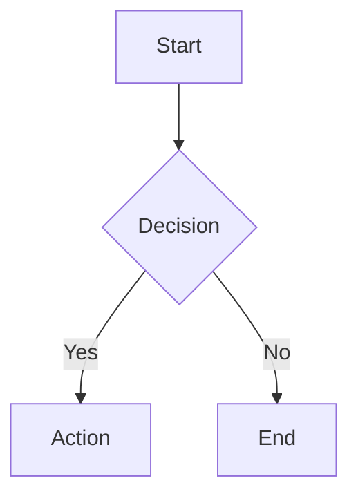

# Plugins (WASM)

## Objetivo
Permitir ampliar OSG mediante plugins WASM seguros (Wazero), con hooks sobre el pipeline.

## Directorio
- `plugins/`: colocar archivos `.wasm`
- `plugins-src/`: codigo fuente de plugins (search, llmstxt, mermaid, archives)
- `examples/plugins/`: plugins de referencia (feed)

## Instalar vs activar
- **Instalar**: copiar el `.wasm` en `plugins/` (o usar `osg plugin install <path>`).
- **Activar**: añadir el nombre del plugin (sin `.wasm`) en `plugins_enabled` del config, o ejecutar `osg plugin enable <name>`.
- **Desactivar**: `osg plugin disable <name>` o eliminarlo de `plugins_enabled`.
- El orden de carga es alfabetico por nombre de archivo.
- Si un plugin esta activado pero el `.wasm` no existe, se ignora y se registra un warning.

### Bundled plugins
OSG incluye plugins embebidos en el binario (`internal/plugin/bundled/`). Se extraen automaticamente a `plugins/` en cada build si no existe una version del usuario. Esto permite al usuario sobreescribir un plugin bundled con su propia version.

Plugins bundled actuales:
- **search**: indice de busqueda full-text (ver seccion dedicada)

### Official plugins (release assets)
Ademas de los plugins bundled, OSG mantiene plugins oficiales en `plugins-src/`
que se compilan y publican como release assets de GitHub en cada release. Estos
plugins **no** se embeben en el binario; se descargan automaticamente cuando se
necesitan.

**Plugins oficiales actuales:**
- **search**: (bundled + release asset) full-text search
- **llmstxt**: genera `/llms.txt` y `/llms-full.txt` para consumo por LLMs
- **mermaid**: renderizado client-side de diagramas Mermaid via CDN
- **archives**: paginas de archivo cronologico agrupadas por ano/mes

**Instalacion manual:**
```bash
# Descargar el .wasm de la ultima release
osg plugin install github.com/jllopis/osg-search
osg plugin install github.com/jllopis/osg-llmstxt
osg plugin install github.com/jllopis/osg-mermaid
osg plugin install github.com/jllopis/osg-archives

# Descargar una version especifica
osg plugin install github.com/jllopis/osg-search@v1.0.0
```

Los `.wasm` tambien estan disponibles para descarga directa en la pagina de
releases: `https://github.com/jllopis/osg/releases`

### Auto-install en osg init
Al ejecutar `osg init`, OSG realiza automaticamente:

1. **Extrae plugins bundled** (embebidos en el binario, como `search`) a `plugins/`.
2. **Descarga plugins oficiales** que estan en `plugins_enabled` del config pero
   no existen en `plugins_dir`. Consulta el indice curado (`plugins-index.json`)
   y descarga el `.wasm` desde la release de GitHub correspondiente.

Este comportamiento permite que un proyecto nuevo funcione inmediatamente con
todos los plugins configurados, sin intervencion manual.

Si la red no esta disponible, la descarga automatica se omite con un warning
(no es un error fatal). Los plugins bundled siempre se extraen sin red.

### CI pipeline
Los plugins en `plugins-src/` se compilan automaticamente por GitHub Actions:

1. El job `build-plugins` instala Rust con target `wasm32-wasip1`
2. Compila cada plugin en `plugins-src/*/` con `cargo build --release`
3. Los `.wasm` resultantes se publican como release assets junto con los binarios

Para compilar localmente:
```bash
make plugins          # compila plugins bundled (search)
make plugins-all      # compila todos los plugins en plugins-src/
make plugins-search   # compila solo search
make plugins-llmstxt  # compila solo llmstxt
make plugins-mermaid  # compila solo mermaid
make plugins-archives # compila solo archives
make install-plugins  # compila todos y copia a plugins/
```

### CLI
```bash
# Instalar desde archivo local
osg plugin install ./dist/my_plugin.wasm --name my-plugin

# Instalar desde GitHub (descarga .wasm de la ultima release)
osg plugin install github.com/user/osg-analytics
osg plugin install github.com/user/osg-analytics@v1.2.0

# Gestionar plugins
osg plugin enable my-plugin
osg plugin disable my-plugin
osg plugin list

# Crear un plugin nuevo
osg plugin init my-plugin --dir plugins_src          # Rust (default)
osg plugin init my-plugin --dir plugins_src --lang go # TinyGo

# Buscar plugins en el indice curado
osg plugin search          # lista todos
osg plugin search analytics

# Actualizar plugins instalados desde GitHub
osg plugin update           # comprueba todos
osg plugin update my-plugin # comprueba uno
```

### TUI
En el prompt de la TUI:
```
/plugin enable my-plugin
/plugin disable my-plugin
/plugin toggle my-plugin
/plugin list
/plugin install github.com/user/osg-analytics
/plugin init my-plugin plugins_src go
/plugin search analytics
/plugin update my-plugin
```

## Requisito: target WASI

Los plugins **deben compilarse con target WASI** para acceder al filesystem:

```bash
# WASI Preview 1 (recomendado)
cargo build --target wasm32-wasip1 --release

# WASI clasic (deprecated pero funciona)
cargo build --target wasm32-wasi --release
```

El target `wasm32-unknown-unknown` **no funciona** porque no tiene acceso a WASI (filesystem, stdout/stderr).

## ABI
El plugin debe exportar:
- `alloc(size: i32) -> i32`
- `handle_event(ptr: i32, len: i32) -> i64`
- `dealloc(ptr: i32, len: i32)` (opcional)
- `plugin_info() -> i64` (opcional, devuelve metadata JSON)

`handle_event` devuelve un `i64` con:
- 32 bits altos: puntero de salida
- 32 bits bajos: longitud de salida

La salida es JSON.

### Entrada JSON

```json
{
  "type": "page.render",
  "payload": { ... }
}
```

### Salida JSON

```json
{
  "payload": {
    "page": { "title": "Nuevo titulo" }
  }
}
```

### Metadata (opcional)

`plugin_info()` devuelve JSON con:
```json
{
  "name": "search",
  "version": "1.0.0",
  "description": "Full-text search index",
  "author": "OSG Team",
  "hooks": ["build.finished"]
}
```

## Eventos

### Eventos de build
| Evento | Cuando | Descripcion |
|--------|--------|-------------|
| `config.validate` | Tras cargar config | Validar config, retornar errors/warnings |
| `build.started` | Antes de renderizar | Preparar recursos |
| `build.finished` | Tras renderizar todo | Generar artefactos adicionales |
| `after.build` | Post-cache, post-finished | Deploy, notificaciones |

### Eventos de contenido
| Evento | Cuando | Descripcion |
|--------|--------|-------------|
| `content.transform` | Antes de renderizar cada pagina | Modificar Markdown |
| `page.before_render` | Antes de renderizar pagina | Modificar contexto pre-template (inyectar datos custom) |
| `page.render` | Al renderizar pagina | Modificar contexto |
| `section.render` | Al renderizar seccion | Modificar contexto |
| `taxonomy.list.render` | Al renderizar lista de taxonomia | Modificar contexto |
| `taxonomy.term.render` | Al renderizar termino | Modificar contexto |
| `feed.transform` | Al generar feeds (site/section) | Modificar contexto del feed antes de serializar |
| `sitemap.transform` | Al generar sitemap | Modificar entries del sitemap (excluir paginas, cambiar priorities) |
| `image.process` | Tras optimizar imagen | Procesar imagenes via WASI |

## Ciclo de vida
1. OSG extrae bundled plugins a `plugins/`
2. OSG carga todos los `.wasm` activados (orden alfabetico)
3. Se emite `config.validate` — si hay errores, el build se detiene
4. Se emite `build.started` antes de renderizar
5. Por cada pagina: `content.transform` (pre-render) → `page.before_render` → `page.render`
6. Por cada seccion: `section.render`
7. Por cada taxonomia: `taxonomy.list.render`, `taxonomy.term.render`
8. Por cada feed: `feed.transform` (site feed y section feeds)
9. Por cada sitemap: `sitemap.transform`
10. Por cada imagen optimizada: `image.process`
11. Se emite `build.finished` al final
12. Se guarda el cache de build
13. Se emite `after.build`
14. OSG cierra los plugins

Errores en plugins (excepto `config.validate`) no detienen el build; se registran como warning.

### Hot-reload en `osg serve`

Cuando se ejecuta `osg serve`, el directorio de plugins (`plugins/`) se monitoriza
automaticamente. Si un fichero `.wasm` cambia, se dispara un rebuild completo que
recarga todos los plugins con la nueva version. No es necesario reiniciar el servidor.

El Manager dispone de `ReloadPlugin(ctx, wasmPath)` para recargar un unico plugin
sin reiniciar el runtime completo (uso interno/futuro).

## Payloads (resumen)

### config.validate
```json
{
  "config": { "base_url": "...", "site_title": "...", ... }
}
```
Retorno esperado:
```json
{
  "errors": ["Error 1", "Error 2"],
  "warnings": ["Warning 1"]
}
```

### content.transform
```json
{
  "config": { ... },
  "page": {
    "title": "...",
    "slug": "...",
    "path": "/2025/01/post/",
    "permalink": "https://...",
    "body_markdown": "# Titulo\n\nContenido...",
    "summary": "...",
    "taxonomies": { "tags": ["go", "test"] },
    "extra": { ... }
  }
}
```
Retorno esperado:
```json
{
  "page": { "body_markdown": "# Titulo modificado\n..." }
}
```

### build.started / build.finished
```json
{
  "config": { ... },
  "site": { "pages": [...], "root": {...} },
  "taxonomies": { ... },
  "stats": { "total": 10, "rendered": 45, ... }
}
```

### image.process
```json
{
  "config": { ... },
  "image": {
    "src_path": "/img/photo.jpg",
    "public_dir": "/abs/path/to/public",
    "original": "/img/photo.jpg",
    "original_width": 1920,
    "variants": [
      { "url_path": "/img/photo-640w.jpg", "width": 640, "format": "jpeg" },
      { "url_path": "/img/photo-640w.webp", "width": 640, "format": "webp" }
    ]
  }
}
```

`stats` incluye: total, rendered, skipped, cached, errors, pages, sections.

## Notas
- El host mergea `payload` sobre el contexto actual (merge profundo de mapas).
- Plugins que fallen no detienen el build (excepto `config.validate` con errors).
- `public_dir` en config siempre es una ruta absoluta para compatibilidad con WASI.

---

## Plugin Search (bundled)

El plugin **search** viene embebido en el binario y genera un indice de busqueda full-text.

### Funcionalidad
- Indexa **contenido completo** de cada pagina (titulo, resumen, contenido HTML, tags)
- Genera `search.json` con todos los documentos
- Genera `/search/index.html` — pagina de busqueda dedicada
- Genera `/js/search.js` — modulo JavaScript reutilizable

### Activacion
```yaml
plugins_enabled: ["search"]  # viene activado por defecto
```

### Busqueda en header
El tema default incluye una barra de busqueda en el header. Requiere:

```html
<script src="/js/search.js" defer></script>
<div class="header-search">
  <input type="search" id="header-search-input" placeholder="Search..." />
  <div id="header-search-results" class="search-dropdown"></div>
</div>
<script>
  new OSGSearch({
    inputSelector: '#header-search-input',
    resultsSelector: '#header-search-results',
    maxResults: 8,
    minChars: 2
  });
</script>
```

### OSGSearch API
```javascript
const search = new OSGSearch({
  inputSelector: '#my-input',     // input[type="search"]
  resultsSelector: '#my-results', // contenedor de resultados
  maxResults: 10,                 // max resultados (default: 10)
  minChars: 2                     // chars minimos para buscar (default: 2)
});
```

### Caracteristicas
- **Normalizacion**: ignora acentos (busqueda "logos" encuentra "logos")
- **Scoring**: titulo > tags > resumen > contenido
- **Excerpts**: muestra contexto alrededor del match
- **Keyboard navigation**: flechas, Enter, Escape
- **Debounce**: 150ms entre busquedas

### Build desde fuente
```bash
cd plugins-src/search
./build.sh
# Genera: search.wasm
# Copia automaticamente a: ../../internal/plugin/bundled/search.wasm
```

O con make:
```bash
make plugins-search
```

---

## Plugin LLMS.txt (oficial)

El plugin **llmstxt** genera archivos de texto optimizados para consumo por modelos de lenguaje (LLMs), siguiendo la especificacion [llms.txt](https://llmstxt.org/).

### Funcionalidad
- Genera `/llms.txt` — resumen del sitio con titulo, enlace y descripcion de cada pagina
- Genera `/llms-full.txt` — version completa con el contenido plain-text de cada pagina
- Separa paginas standalone (menu) de posts normales
- Ordena posts por fecha descendente
- Excluye borradores automaticamente
- Convierte HTML a texto plano (strip tags, decode entities)

### Formato de salida

**llms.txt** (resumen):
```
# Site Title

> Site description

## Pages

- [About](/about): Short description of the about page

## Posts

- [My First Post](/2025/01/my-first-post): Summary of the post
- [Another Post](/2024/12/another-post): Summary text
```

**llms-full.txt** (completo):
```
# Site Title

> Site description

## Posts

### My First Post

Date: 2025-01-15
URL: https://example.com/2025/01/my-first-post

Full plain text content of the post...

---
```

### Activacion
```yaml
plugins_enabled: ["llmstxt"]
```

### Hook
- `build.finished` — genera los archivos en `public_dir`

### Build desde fuente
```bash
cd plugins-src/llmstxt
./build.sh
# Genera: llmstxt.wasm
```

O con make:
```bash
make plugins-llmstxt
```

---

## Plugin Mermaid (oficial)

El plugin **mermaid** permite incluir diagramas [Mermaid](https://mermaid.js.org/) en notas Markdown, renderizados client-side via CDN.

### Funcionalidad
- Transforma bloques ` ```mermaid ` en Markdown a `<pre class="mermaid">` HTML
- Genera `/js/mermaid-init.js` — loader que carga mermaid.js solo si hay diagramas
- Auto-deteccion de tema dark/light via `prefers-color-scheme`
- Security: `securityLevel: 'strict'`
- CDN: jsdelivr.net, mermaid v11.4.1

### Uso en Markdown

En cualquier nota Obsidian:

````markdown

````

El plugin transforma esto en HTML que mermaid.js renderiza como diagrama SVG interactivo.

### Integracion con el tema

Para que `mermaid-init.js` se cargue en las paginas, agregar al template `base.html` o `page.html`:

```html
<script src="/js/mermaid-init.js" defer></script>
```

El script detecta automaticamente si hay diagramas en la pagina y solo carga mermaid.js del CDN cuando es necesario (lazy loading).

### Activacion
```yaml
plugins_enabled: ["mermaid"]
```

### Hooks
- `content.transform` — reescribe bloques mermaid en el Markdown de cada pagina
- `build.finished` — genera `mermaid-init.js` en `public_dir/js/`

### Build desde fuente
```bash
cd plugins-src/mermaid
./build.sh
# Genera: mermaid.wasm
```

O con make:
```bash
make plugins-mermaid
```

---

## Plugin Archives (oficial)

El plugin **archives** genera paginas de archivo cronologico con todos los posts del sitio, agrupados por ano y mes.

### Funcionalidad
- Genera `/archive/index.html` — pagina principal con listado completo y navegacion por anos
- Genera `/archive/YYYY/index.html` — pagina por ano con agrupacion por mes
- Muestra fecha, titulo y resumen de cada post
- Navegacion entre anos y link de vuelta al home
- CSS Nord-styled con dark/light mode auto
- Layout responsive (grid en desktop, stack en movil)
- Excluye borradores y paginas de menu

### Resultado

```
/archive/
/archive/index.html     — listado completo con navegacion
/archive/2025/
/archive/2025/index.html — posts de 2025 por mes
/archive/2024/
/archive/2024/index.html — posts de 2024 por mes
```

### Activacion
```yaml
plugins_enabled: ["archives"]
```

### Hook
- `build.finished` — genera las paginas HTML en `public_dir/archive/`

### Build desde fuente
```bash
cd plugins-src/archives
./build.sh
# Genera: archives.wasm
```

O con make:
```bash
make plugins-archives
```

---

## Ejemplo: Feed (referencia)

En `examples/plugins/feed` hay un plugin de referencia que genera RSS:

```bash
cd examples/plugins/feed
rustc --print target-list | grep -q "^wasm32-wasi$" && TARGET="wasm32-wasi" || TARGET="wasm32-wasip1"
rustup target add "$TARGET"
cargo build --target "$TARGET" --release
cp target/$TARGET/release/osg_feed.wasm feed.wasm
```

Nota: OSG ya genera feeds nativamente desde Phase 10. Este plugin es solo referencia.

---

## SDK Go (TinyGo)

OSG incluye un SDK para escribir plugins en Go, compilados con TinyGo a WASM.

### Crear un plugin Go

```bash
osg plugin init my-plugin --lang go
cd plugins_src/my-plugin
```

Esto genera:
- `main.go` — plugin template con `//go:wasmexport`, plugin_info, handle_event
- `go.mod` — modulo Go
- `build.sh` — script de compilacion TinyGo
- `README.md` — documentacion con tabla de hooks

### Compilar

```bash
# Requiere TinyGo >= 0.35
chmod +x build.sh
./build.sh
# Genera: my-plugin.wasm
```

### Estructura del template

```go
//go:wasmexport plugin_info
func pluginInfo() uint64 { ... }

//go:wasmexport handle_event
func handleEvent(ptr int32, size int32) uint64 { ... }

//go:wasmexport alloc
func alloc(size int32) int32 { ... }
```

### SDK package (internal/plugin/sdk)

Para plugins mas complejos, el SDK Go proporciona tipos y helpers:

```go
import "osg/internal/plugin/sdk"

// Tipos
sdk.Event{Type: "build.finished", Payload: map[string]any{...}}
sdk.Response{Payload: map[string]any{...}}
sdk.PluginMeta{Name: "my-plugin", Version: "1.0.0", Hooks: []string{"build.finished"}}

// Plugin con handlers
p := sdk.NewPlugin("my-plugin", "1.0.0")
p.On("build.finished", func(payload map[string]any) map[string]any {
    // logica del plugin
    return nil
})

// Helpers
sdk.GetString(payload, "config", "public_dir")  // acceso seguro a mapas anidados
sdk.GetBool(payload, "config", "lightbox")
sdk.PackPtrLen(ptr, length)                      // empaqueta ptr+len en u64
```

---

## Instalar desde GitHub

OSG puede descargar plugins directamente desde GitHub Releases:

```bash
osg plugin install github.com/user/osg-analytics
osg plugin install github.com/user/osg-analytics@v2.0.0
```

### Como funciona

1. OSG detecta el formato `github.com/owner/repo[@tag]`
2. Consulta la GitHub Releases API (latest si no se especifica tag)
3. Busca un asset `.wasm` en la release
4. Descarga el `.wasm` a `plugins/`
5. Registra source + version en `.osg/plugins.lock.json`

### GITHUB_TOKEN

Para repos privados o evitar rate limits:

```bash
export GITHUB_TOKEN=ghp_xxxx
osg plugin install github.com/private-org/my-plugin
```

### Lock file

El lock file (`.osg/plugins.lock.json`) registra cada plugin instalado desde GitHub:

```json
{
  "plugins": {
    "osg-analytics": {
      "source": "github.com/user/osg-analytics",
      "version": "v2.0.0"
    }
  }
}
```

### Actualizar plugins

```bash
osg plugin update                # comprueba todos los plugins del lock file
osg plugin update osg-analytics  # comprueba uno especifico
```

Si hay una version mas reciente en GitHub, se descarga automaticamente.

---

## Indice curado de plugins

OSG mantiene un indice curado de plugins (`plugins-index.json`) en el repositorio.

### Buscar plugins

```bash
osg plugin search            # lista todos
osg plugin search analytics  # filtra por nombre, descripcion o autor
```

Ejemplo de salida:
```
search (0.1.0) — Full-text search with header bar, standalone page, and keyboard navigation
  install: osg plugin install github.com/jllopis/osg-search
```

### Formato del indice

```json
{
  "plugins": [
    {
      "name": "search",
      "description": "Full-text search with header bar and keyboard navigation",
      "author": "jllopis",
      "repo": "github.com/jllopis/osg-search",
      "version": "0.1.0"
    }
  ]
}
```

---

## Wikilinks (Obsidian)

OSG procesa automaticamente los wikilinks de Obsidian durante `update-content`:

### Tipos de wikilinks

| Tipo | Ejemplo | Conversion |
|------|---------|------------|
| Imagen | `![[image.png]]` | `` |
| Imagen con alt | `![[image.png|Alt text]]` | `` |
| Texto | `[[Note Title]]` | `[Note Title](/path/)` o `Note Title` |
| Texto con display | `[[Note Title|display]]` | `[display](/path/)` o `display` |

### Resolucion de enlaces

- **Si existe la pagina**: `[[Otra Nota]]` → `[Otra Nota](/2025/01/otra-nota/)`
- **Si no existe**: `[[Nota Inexistente]]` → `Nota Inexistente` (texto plano)

El indice de paginas se construye durante la primera pasada de `update-content`,
comparando titulos normalizados (minusculas, sin acentos).

**Aliases**: Si una nota tiene `aliases` en el frontmatter, tambien se incluyen
en el indice. Esto permite que `[[sincronicidad]]` resuelva a una nota titulada
"Sincronicidad" que tenga `aliases: [sincronicidad]`.

### Frontmatter

Los wikilinks en el frontmatter (`tags`, `area`, etc.) se procesan de la misma
manera. Sin embargo, los taxonomies se normalizan sin los corchetes.

Ejemplo:
```yaml
area: '[[Filosofia]]'
tags:
  - '[[Logica]]'
  - '[[Argumentacion]]'
```

Se convierte en:
```yaml
area: Filosofia
tags:
  - Logica
  - Argumentacion
```

### Limitaciones

- La resolucion es por titulo exacto (case-insensitive) o alias
- No soporta secciones (`[[Note#section]]`)
- No soporta bloques (`[[Note^block]]`)

